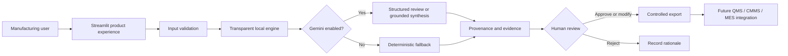

# Advanced Manufacturing AI Portfolio

> A recruiter-ready and user-ready demonstration of how AI can improve quality investigations, manufacturing knowledge access, and frontline fault triage—without removing accountable human decision-making.

[](https://github.com/vikasvindushri/manufacturing-ai-portfolio/actions)


## 30-second portfolio introduction

Manufacturing teams often lose time converting unstructured incidents into investigation records, searching fragmented engineering knowledge, and standardizing first-response equipment triage. This portfolio demonstrates three practical applications that combine transparent local logic, optional Gemini assistance, cited evidence, structured records, and human approval gates. The design deliberately separates **facts, hypotheses, recommendations, and decisions**.

## Business problems addressed

### 1. AI Quality & 8D Assistant
**Problem:** Initial quality investigations vary in completeness and take time to structure.

**User:** Quality engineer, manufacturing engineer, supplier quality engineer, production leader.

**Product experience:** Enter or upload an incident, generate a governed 8D draft, inspect evidence gaps and cause hypotheses, conduct an optional Gemini review, record accountable approval, and export a complete JSON case record.

**Value hypothesis:** Faster first draft, more consistent intake, better evidence discipline, and improved auditability. The assistant never declares an unverified root cause.

### 2. Manufacturing Knowledge Assistant
**Problem:** Personnel spend time locating applicable quality and engineering guidance across documents.

**User:** Operators, technicians, engineers, quality personnel, and supervisors.

**Product experience:** Ask a natural-language question, retrieve ranked local evidence, view source/chunk references, optionally synthesize an answer with Gemini, and provide feedback on usefulness.

**Value hypothesis:** Reduced search time and improved answer traceability. No evidence means no answer.

### 3. Low-Code Manufacturing AI Agent
**Problem:** Fault reports are inconsistent, and first-response triage depends heavily on individual experience.

**User:** Operator, team leader, maintenance technician, manufacturing engineer.

**Product experience:** Submit a fault event, classify it with transparent rules, review likely causes and checks, add an optional Gemini second opinion, make a human decision, and export a low-code-ready action record.

**Value hypothesis:** More consistent escalation, clearer handoffs, and structured data for CMMS/QMS/MES integration.

## Architecture



## Product principles

1. **Local-first:** Every project remains useful without a paid API.
2. **Evidence-first:** Recommendations are linked to provided facts or retrieved text.
3. **Human-owned decisions:** AI drafts; qualified personnel approve.
4. **Safe failure:** Missing evidence, disabled Gemini, or retrieval failure produces a visible fallback.
5. **Audit-friendly outputs:** Exports contain provenance, status, source data, review, and approval fields.
6. **Integration-ready:** JSON schemas and workflow documentation support low-code and enterprise evolution.

## Quick start

### Windows Git Bash

```bash
python -m venv .venv
source .venv/Scripts/activate
python -m pip install --upgrade pip
python -m pip install -r requirements.txt
python -m pytest
python -m streamlit run app.py
```

### macOS or Linux

```bash
python3 -m venv .venv
source .venv/bin/activate
python -m pip install --upgrade pip
python -m pip install -r requirements.txt
python -m pytest
python -m streamlit run app.py
```

Open `http://localhost:8501` if the browser does not open automatically.

## Run each product

From the repository root:

```bash
# Git Bash users: makes repository packages importable
export PYTHONPATH="$PWD"

python -m streamlit run project_1_quality_8d/app.py
python -m streamlit run project_2_rag/app.py
python -m streamlit run project_3_low_code_agent/app.py
```

## Optional Gemini setup

The project uses the official `google-genai` SDK. Gemini is disabled by default so the portfolio can be evaluated without a key.

```bash
cp .env.example .env
```

Edit `.env`:

```dotenv
GEMINI_API_KEY=your_private_key
GEMINI_MODEL=gemini-3.6-flash
ENABLE_GEMINI=true
```

Never commit `.env`. Confirm protection:

```bash
git check-ignore -v .env
```

Test configuration without exposing the key:

```bash
python scripts/check_environment.py
```

Test the real API:

```bash
python scripts/test_gemini_connection.py
```

## Interview demonstration plan

### Recommended seven-minute flow

**Minute 0–1 — Frame the problem**

> “I selected three workflows where manufacturing teams spend time structuring information, finding evidence, and coordinating action. My design goal was not to automate accountable decisions. It was to improve the quality and speed of preparation while preserving human control.”

**Minute 1–3 — Quality Assistant**

1. Launch the sample torque incident.
2. Explain the normalized facts and missing-field check.
3. Generate the deterministic 8D scaffold.
4. Show that root causes are labeled as hypotheses.
5. Open the Gemini review and explain structured output.
6. Demonstrate that export approval requires named human review.

**Minute 3–5 — Knowledge Assistant**

1. Ask: “What should be checked after a torque failure?”
2. Show ranked chunks and relevance scores.
3. Point to source references.
4. Explain that Gemini synthesizes only retrieved evidence.
5. Ask an unrelated question to demonstrate the no-evidence fallback.

**Minute 5–6 — Fault Triage Agent**

1. Load the hydraulic-pressure example.
2. Show rule-based classification and diagnostics.
3. Compare the optional Gemini review.
4. Select Accept/Modify/Reject and export the record.
5. Explain how the JSON maps to Power Apps, AppSheet, CMMS, or QMS.

**Minute 6–7 — Close with engineering maturity**

> “The prototype is intentionally local-first and transparent. A production pilot would add governed document ingestion, enterprise identity, telemetry, evaluation datasets, audit storage, and controlled QMS/CMMS integration. I would measure cycle time, completeness, citation coverage, human override rate, adoption, and action effectiveness.”

See [`docs/INTERVIEW_DEMO_PLAYBOOK.md`](docs/INTERVIEW_DEMO_PLAYBOOK.md) for detailed scripts and likely interview questions.

## What the implementation demonstrates

- Manufacturing process and quality problem framing
- 8D, RCA, 5-Why, PFMEA and control-plan thinking
- RAG concepts and evidence-grounded generation
- Structured extraction and typed AI outputs
- Local deterministic fallbacks
- Human-in-the-loop governance
- Low-code workflow and integration design
- Gemini API integration
- Python package organization and automated testing
- CI, Docker, documentation, security and adoption planning

## Evaluation and KPIs

| Capability | Example metric | Why it matters |
|---|---:|---|
| Quality draft | Median intake-to-draft time | Tests cycle-time reduction |
| Completeness | Required-field completion rate | Tests standardization |
| RAG retrieval | Recall@k / citation coverage | Tests evidence quality |
| Grounding | Unsupported-claim rate | Tests reliability |
| Triage | Agreement with expert classification | Tests operational usefulness |
| Governance | Human override and rejection rate | Detects weak recommendations |
| Adoption | Weekly active users / repeat use | Tests practical value |
| Business | Validated hours saved and avoided-cost range | Tests ROI without inflated claims |

## Repository structure

```text
manufacturing-ai-portfolio/
├── app.py                          # Portfolio landing page
├── shared/                         # Theme, Gemini service, typed schemas
├── project_1_quality_8d/           # Quality and 8D product
├── project_2_rag/                  # Evidence-backed knowledge product
├── project_3_low_code_agent/       # Fault triage product
├── docs/                           # Interview, user, product and governance docs
├── scripts/                        # Environment and Gemini diagnostics
├── tests/                          # Automated tests
├── .github/                        # CI and contribution templates
├── Dockerfile
├── docker-compose.yml
└── requirements.txt
```

## Production roadmap

- **Phase 0 — Discovery:** validate users, baseline performance, data classification, expected value, and stop-use criteria.
- **Phase 1 — Prototype:** synthetic/de-identified data, deterministic baseline, SME review, failure-mode testing.
- **Phase 2 — Shadow pilot:** compare recommendations with expert decisions without changing operations.
- **Phase 3 — Controlled deployment:** role-based access, monitoring, human approval, limited integrations.
- **Phase 4 — Scale:** released-document ingestion, evaluation pipelines, change control, site rollout and ROI validation.

## Responsible use

This repository is a portfolio demonstrator—not a production QMS, MES, CMMS, safety system, or product-disposition authority. Never bypass safeguards or approved procedures. Do not send confidential drawings, production records, personal data, supplier data, or export-controlled content to an unapproved AI service.

## License

MIT. Synthetic examples only.
