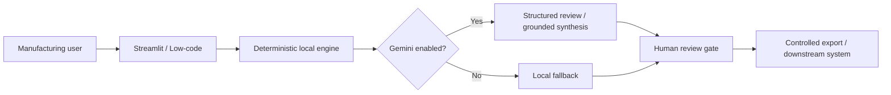

# Advanced Manufacturing AI Portfolio

A polished, production-minded portfolio of three governed AI transformation projects for Manufacturing, Quality and Operations.

## What is new in the advanced edition
- Premium Streamlit experience with consistent visual language, metrics, tabs, chat and export workflows.
- Dual-mode architecture: fully functional local logic plus optional Gemini enhancement.
- Gemini structured outputs for quality review and fault triage.
- Evidence-constrained Gemini synthesis for the RAG assistant.
- Provenance metadata, human approval gates, cautious prompts and deterministic fallbacks.
- Portfolio landing dashboard, Docker deployment, CI tests and low-code integration artifacts.

## Applications
```bash
streamlit run app.py
streamlit run project_1_quality_8d/app.py
streamlit run project_2_rag/app.py
streamlit run project_3_low_code_agent/app.py
```

## Installation
```bash
python -m venv .venv
# Git Bash on Windows
source .venv/Scripts/activate
python -m pip install -r requirements.txt
python -m pytest
```

## Enable Gemini securely
1. Copy `.env.example` to `.env`.
2. Add your own API key; never commit it.
3. Set `ENABLE_GEMINI=true`.
4. Optionally change `GEMINI_MODEL` to a model available to your account.

```dotenv
GEMINI_API_KEY=your_key_here
GEMINI_MODEL=gemini-2.5-flash
ENABLE_GEMINI=true
```

The official `google-genai` SDK is used. Local mode remains available when Gemini is disabled or unavailable.

## Architecture


## Responsible-use boundaries
This repository is a demonstrator, not a production QMS, MES, CMMS or safety system. Do not use synthetic recommendations as product-disposition authority. Protect confidential manufacturing data and use only approved AI services.
