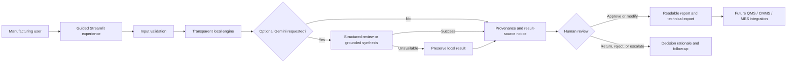

# Manufacturing AI Studio

> A governed, local-first product suite for quality investigations, evidence-backed manufacturing knowledge, and operational fault triage.

[](https://github.com/vikasvindushri/manufacturing-ai-portfolio/actions)


## Overview

Manufacturing teams frequently lose time converting unstructured incidents into investigation records, locating applicable engineering knowledge, and coordinating consistent first-response fault triage. Manufacturing AI Studio shows how transparent local logic, optional Gemini assistance, cited evidence, structured records, and human approval gates can improve these workflows without transferring accountable decisions to an AI system.

The suite contains three guided applications:

1. **Quality & 8D Assistant** — creates a structured investigation draft, evidence checklist, cause hypotheses, review record, and controlled case export.
2. **Manufacturing Knowledge Assistant** — retrieves local engineering and quality evidence, displays references, and optionally produces a grounded Gemini synthesis.
3. **Fault Triage Agent** — classifies a reported issue, proposes diagnostic checks, captures human review, and produces an integration-ready action record.

## Delivery Status

- **Current release:** v0.5
- **Phase 1 — Product Foundation:** Complete
- **Phase 2 — Guided Workflow Configuration:** Planned
- **Phase 3 — Data and Connector Studio:** Planned
- **Phase 4 — Governance and Evaluation Center:** Planned
- **Phase 5 — Visual Workflow Studio:** Planned
- **Phase 6 — Enterprise Productization:** Planned

Version 0.5 upgrades the Manufacturing Knowledge Assistant with conversational, evidence-backed retrieval with professional report presentation, record-readiness indicators, transparent local and Gemini analysis, per-case AI controls, expanded human review, data classification, and system-health visibility.

- **v0.5 highlight:** upload approved documents, apply metadata filters, ask follow-up questions, inspect claim-level citations, and evaluate retrieval quality.

- [View the full release history](CHANGELOG.md)
- [Review the product roadmap](docs/PRODUCT_ROADMAP.md)
- [Review Phase 1 completion evidence](docs/PHASE_1_COMPLETION.md)

## Product Maturity

Manufacturing AI Studio v0.5 is a working Phase 1 product foundation. It provides guided workflows, local processing, optional Gemini enhancement, human review controls, readable reports, technical exports, session history, audit events, environment profiles, and automated tests.

It is not yet an enterprise production system. Persistent multi-user storage, authentication, approved business-system connectors, centralized monitoring, and formal operational validation are planned for later phases.

## Business Use Cases

### Quality & 8D Assistant

**Challenge:** Initial incident records vary in completeness, and investigation teams spend time repeatedly structuring the same information.

**Primary users:** Quality engineers, manufacturing engineers, supplier quality engineers, and production leaders.

**Workflow:**

1. Select a reusable scenario or enter an incident through a validated form.
2. Normalize facts and identify missing information.
3. Generate a deterministic 8D scaffold.
4. Review facts, evidence gaps, root-cause hypotheses, 5-Why prompts, and action candidates.
5. Optionally request a Gemini review when policy and data classification permit it.
6. Record a qualified human review decision.
7. Export a readable report or technical JSON record.

**Expected value:** Reduced preparation time, improved information consistency, stronger evidence discipline, and more auditable handoffs.

### Manufacturing Knowledge Assistant

**Challenge:** Applicable guidance is often distributed across quality, maintenance, process, and engineering documents.

**Primary users:** Operators, technicians, engineers, quality personnel, and supervisors.

**Workflow:**

1. Ask a validated natural-language question.
2. Retrieve ranked local evidence.
3. Inspect source, chunk, and relevance information.
4. Optionally synthesize a response with Gemini using only retrieved context.
5. Verify document applicability before use.
6. Record feedback and export the search record.

**Expected value:** Reduced search time, improved traceability, and more consistent access to controlled knowledge.

### Fault Triage Agent

**Challenge:** Unstructured fault reports can lead to inconsistent classification, escalation, and handoff quality.

**Primary users:** Operators, team leaders, maintenance technicians, and manufacturing engineers.

**Workflow:**

1. Select a sample scenario or enter a fault through a validated form.
2. Classify the issue using transparent local rules.
3. Review facts, evidence gaps, likely causes, and diagnostic checks.
4. Optionally request a Gemini second-pass review.
5. Accept, modify, return, reject, or escalate the recommendation.
6. Export a readable action report or technical JSON record.

**Expected value:** More consistent escalation, clearer ownership, and structured data for future CMMS, QMS, or MES integration.

## Key Capabilities

- Unified navigation across all three workflows
- Validated forms and reusable sample scenarios
- Local deterministic processing that works without Gemini
- Resilient Gemini fallback that preserves successful local outcomes
- Explicit result-source and AI-use notices
- Professional report headers and readiness indicators
- Clear separation of facts, gaps, hypotheses, and recommendations
- Side-by-side local and optional Gemini analysis
- Editable review screens and expanded human decisions
- Per-case data classification and AI selection
- Session drafts, history, feedback, and structured audit events
- Readable Markdown, printable HTML, and technical JSON downloads
- Environment profiles and system-health diagnostics
- Automated tests and GitHub Actions CI

## Architecture



## Reliability Model

Local processing is the dependable baseline. Gemini is an optional enrichment and never blocks a successful local workflow.

- **Local result:** “Result generated by the local deterministic engine. Gemini AI was not used.”
- **Fallback result:** “Result generated successfully by the local deterministic engine. The optional Gemini AI enhancement was unavailable and was not used.”
- **Enhanced result:** The record identifies both the local engine and the optional Gemini review while preserving mandatory human validation.

See [Local and Gemini Execution](docs/LOCAL_AND_GEMINI_EXECUTION.md) for the detailed behavior and status model.

## Quick Start

### Windows Git Bash

```bash
python -m venv .venv
source .venv/Scripts/activate
python -m pip install --upgrade pip
python -m pip install -r requirements.txt
python -m pytest
python -m streamlit run app.py
```

### macOS or Linux

```bash
python3 -m venv .venv
source .venv/bin/activate
python -m pip install --upgrade pip
python -m pip install -r requirements.txt
python -m pytest
python -m streamlit run app.py
```

Open `http://localhost:8501` if the browser does not open automatically.

## Configuration

The default local profile does not require an AI API key.

```dotenv
APP_PROFILE=local
ENABLE_GEMINI=false
GEMINI_MODEL=gemini-3.6-flash
```

To enable optional Gemini enhancement, copy the example configuration:

```bash
cp .env.example .env
```

Then set:

```dotenv
APP_PROFILE=gemini
ENABLE_GEMINI=true
GEMINI_API_KEY=your_private_key
GEMINI_MODEL=gemini-3.6-flash
```

Never commit `.env`. Confirm that Git ignores it:

```bash
git check-ignore -v .env
```

Run configuration and connection diagnostics:

```bash
python scripts/check_environment.py
python scripts/test_gemini_connection.py
```

## Using the Product

Start the unified application:

```bash
python -m streamlit run app.py
```

Use the left navigation for:

- Home
- Quality & 8D
- Knowledge Assistant
- Fault Triage
- Session History
- System Health

Each workflow provides sample scenarios, validated inputs, visible analysis provenance, editable review, human decisions, and downloads.

For a concise walkthrough, see [Product Demonstration](docs/PRODUCT_DEMONSTRATION.md). For operating guidance, see the [User Guide](docs/USER_GUIDE.md).

## Output Formats

Every completed workflow supports complementary audiences:

- **Readable Markdown** — editable plain-language business record
- **Printable HTML** — professional browser view that can be printed or saved as PDF
- **Technical JSON** — machine-readable contract for integration, automation, testing, and future system persistence

The interface also displays a clear documentation view without programming syntax.

## Testing and Diagnostics

Run the automated test suite:

```bash
python -m pytest
```

Run accessibility source checks:

```bash
python scripts/accessibility_check.py
```

Run environment diagnostics:

```bash
python scripts/check_environment.py
```

The repository includes tests for local processing, Gemini success and failure states, fallback preservation, validation, retrieval, reports, readiness, audit redaction, configuration profiles, and system health.

## Evaluation and Operating Metrics

The product is designed to support measurement across later phases:

- Quality preparation time and required-field completeness
- Retrieval recall, citation coverage, and no-evidence behavior
- Unsupported-claim rate
- Triage agreement with qualified experts
- Human modification, rejection, and escalation rates
- Gemini availability and local-fallback completion
- Workflow completion, repeat use, and validated time savings

Phase 1 provides measurement instrumentation. Formal baseline comparison begins in Phase 2, operational pilot measurement expands in Phase 3, and governed monitoring is planned for Phase 4.

See the [Test and Evaluation Plan](docs/TEST_AND_EVALUATION_PLAN.md) and [ROI Model](docs/ROI_MODEL.md).

## Repository Structure

```text
manufacturing-ai-portfolio/
├── app.py                          # Unified product application
├── services/                       # Resilient workflow orchestration
├── shared/                         # UI, reports, configuration, audit, and Gemini services
├── config/profiles/                # Local, Gemini, and demonstration profiles
├── project_1_quality_8d/           # Quality investigation engine and samples
├── project_2_rag/                  # Evidence retrieval engine and knowledge base
├── project_3_low_code_agent/       # Fault triage engine and workflow schemas
├── docs/                           # Product, user, governance, and roadmap documentation
├── scripts/                        # Environment, connection, and accessibility diagnostics
├── tests/                          # Automated test suite
├── .github/                        # CI and contribution templates
├── CHANGELOG.md                    # Release history from v0.2 onward
├── VERSION                         # Current release number
├── Dockerfile
├── docker-compose.yml
└── requirements.txt
```

## Documentation

### Product and Planning

- [Executive Summary](docs/EXECUTIVE_SUMMARY.md)
- [Product Requirements](docs/PRODUCT_REQUIREMENTS.md)
- [Product Roadmap](docs/PRODUCT_ROADMAP.md)
- [Phase 1 Completion](docs/PHASE_1_COMPLETION.md)
- [Release History](CHANGELOG.md)

### User Guidance

- [User Guide](docs/USER_GUIDE.md)
- [Product Demonstration](docs/PRODUCT_DEMONSTRATION.md)

### Architecture, AI, and Operations

- [Architecture](docs/ARCHITECTURE.md)
- [Local and Gemini Execution](docs/LOCAL_AND_GEMINI_EXECUTION.md)
- [Gemini Integration](docs/GEMINI_INTEGRATION.md)
- [Governance](docs/GOVERNANCE.md)
- [Security and Data Handling](docs/SECURITY.md)

### Evaluation and Value

- [Test and Evaluation Plan](docs/TEST_AND_EVALUATION_PLAN.md)
- [ROI Model](docs/ROI_MODEL.md)
- [AI Use-Case Canvas](docs/USE_CASE_CANVAS.md)

## Responsible Use

This repository is a demonstrator, not a production QMS, MES, CMMS, safety system, or product-disposition authority. Never bypass safeguards or approved procedures. Do not send confidential drawings, production records, personal data, supplier data, or export-controlled content to an unapproved AI service.

Record readiness measures intake completeness; it does not represent AI accuracy, root-cause confidence, or probability of correctness. Qualified personnel remain responsible for evidence validation, disposition, corrective action, approval, and closure.

## Contributing

See [CONTRIBUTING.md](CONTRIBUTING.md) for contribution expectations and data-handling requirements.

## License

MIT. See [LICENSE](LICENSE). Synthetic examples only.
