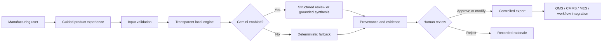

# Manufacturing AI Studio

> A governed, local-first product suite for quality investigations, evidence-backed manufacturing knowledge, and operational fault triage.

[](https://github.com/vikasvindushri/manufacturing-ai-portfolio/actions)


## Overview

Manufacturing teams frequently lose time converting unstructured incidents into investigation records, locating applicable engineering knowledge, and coordinating consistent first-response fault triage. Manufacturing AI Studio demonstrates how transparent local logic, optional Gemini assistance, cited evidence, structured records, and human approval gates can improve these workflows without transferring accountable decisions to an AI system.

The suite contains three end-to-end applications:

1. **Quality & 8D Assistant** — creates a structured investigation draft, evidence checklist, cause hypotheses, and controlled case export.
2. **Manufacturing Knowledge Assistant** — retrieves local engineering and quality evidence, displays references, and optionally produces a grounded Gemini synthesis.
3. **Fault Triage Agent** — classifies a reported issue, proposes diagnostic checks, captures human review, and produces an integration-ready action record.

## Business use cases

### Quality & 8D Assistant

**Challenge:** Initial incident records vary in completeness, and investigation teams spend time repeatedly structuring the same information.

**Primary users:** Quality engineers, manufacturing engineers, supplier quality engineers, and production leaders.

**Workflow:**

1. Enter or upload an incident.
2. Normalize facts and identify missing information.
3. Generate a deterministic 8D scaffold.
4. Review root-cause hypotheses and 5-Why prompts.
5. Optionally request a structured Gemini review.
6. Capture qualified human approval.
7. Export the complete case record.

**Expected value:** Reduced preparation time, improved information consistency, stronger evidence discipline, and more auditable handoffs.

### Manufacturing Knowledge Assistant

**Challenge:** Applicable guidance is often distributed across quality, maintenance, process, and engineering documents.

**Primary users:** Operators, technicians, engineers, quality personnel, and supervisors.

**Workflow:**

1. Ask a natural-language question.
2. Retrieve ranked local evidence.
3. Inspect source and chunk references.
4. Optionally synthesize a response with Gemini using only the retrieved context.
5. Verify document applicability before use.

**Expected value:** Reduced search time, improved traceability, and more consistent access to controlled knowledge.

### Fault Triage Agent

**Challenge:** Unstructured fault reports can lead to inconsistent classification, escalation, and handoff quality.

**Primary users:** Operators, team leaders, maintenance technicians, and manufacturing engineers.

**Workflow:**

1. Submit a structured fault event.
2. Classify the issue using transparent rules.
3. Review likely causes and diagnostic checks.
4. Optionally request a Gemini second-pass review.
5. Accept, modify, or reject the recommendation.
6. Export an action record for a downstream workflow.

**Expected value:** More consistent escalation, clearer ownership, and structured data for future CMMS, QMS, or MES integration.

## Delivery status

- **Phase 1 — Product foundation:** ✅ Complete
- **Phase 2 — Guided workflow configuration:** Planned
- **Phase 3 — Data and connector studio:** Planned

Phase 1 evidence and verification are documented in [`docs/PHASE_1_COMPLETION.md`](docs/PHASE_1_COMPLETION.md).

## Architecture



## Product principles

- **Local-first:** Core functionality works without a paid AI service.
- **Evidence-first:** Recommendations remain linked to supplied facts or retrieved text.
- **Human-owned decisions:** AI prepares and recommends; accountable personnel decide.
- **Safe failure:** Missing evidence, disabled Gemini, and retrieval failure produce visible fallback behavior.
- **Audit-ready outputs:** Exports contain source data, status, provenance, review, and approval fields.
- **Integration-ready contracts:** JSON schemas and workflow documentation support enterprise evolution.
- **Guided usability:** Sample data and clear steps allow users to explore each workflow with minimal setup.

## Quick start

### Windows Git Bash

```bash
python -m venv .venv
source .venv/Scripts/activate
python -m pip install --upgrade pip
python -m pip install -r requirements.txt
python -m pytest
python -m streamlit run app.py
```

### macOS or Linux

```bash
python3 -m venv .venv
source .venv/bin/activate
python -m pip install --upgrade pip
python -m pip install -r requirements.txt
python -m pytest
python -m streamlit run app.py
```

Open `http://localhost:8501` if the browser does not open automatically.

## Run an individual application

Run commands from the repository root:

```bash
# Helpful for Git Bash when launching a nested Streamlit app
export PYTHONPATH="$PWD"

python -m streamlit run project_1_quality_8d/app.py
python -m streamlit run project_2_rag/app.py
python -m streamlit run project_3_low_code_agent/app.py
```

## Optional Gemini setup

Gemini is disabled by default so the suite remains functional without an API key.

```bash
cp .env.example .env
```

Edit `.env`:

```dotenv
GEMINI_API_KEY=your_private_key
GEMINI_MODEL=gemini-3.6-flash
ENABLE_GEMINI=true
```

Never commit `.env`. Verify that Git ignores it:

```bash
git check-ignore -v .env
```

Check the local configuration:

```bash
python scripts/check_environment.py
```

Test a real Gemini request:

```bash
python scripts/test_gemini_connection.py
```

## Guided product demonstration

A concise end-to-end walkthrough is available in [`docs/PRODUCT_DEMONSTRATION.md`](docs/PRODUCT_DEMONSTRATION.md).

Recommended flow:

1. Generate the supplied torque incident in the Quality Assistant.
2. Inspect evidence gaps, hypotheses, provenance, and the approval gate.
3. Ask the Knowledge Assistant what should be checked after a torque failure.
4. Inspect the retrieved references and no-evidence behavior.
5. Process the hydraulic-pressure sample in the Fault Triage Agent.
6. Record a human decision and inspect the exported action payload.

## Evaluation and operating metrics

| Capability | Example metric | Purpose |
|---|---:|---|
| Quality preparation | Median intake-to-draft time | Measures cycle-time improvement |
| Investigation completeness | Required-field completion rate | Measures consistency |
| Retrieval | Recall@k and citation coverage | Measures evidence quality |
| Grounding | Unsupported-claim rate | Measures response reliability |
| Triage | Agreement with expert classification | Measures operational usefulness |
| Governance | Human override and rejection rate | Identifies weak recommendations |
| Adoption | Active users and repeat use | Measures practical value |
| Business value | Validated hours saved and cost range | Supports responsible ROI analysis |

## Repository structure

```text
manufacturing-ai-portfolio/
├── app.py                          # Product-suite landing page
├── shared/                         # Theme, Gemini service, typed schemas
├── project_1_quality_8d/           # Quality investigation application
├── project_2_rag/                  # Evidence-backed knowledge application
├── project_3_low_code_agent/       # Fault triage application
├── docs/                           # Product, user, governance, and roadmap docs
├── scripts/                        # Environment and Gemini diagnostics
├── tests/                          # Automated tests
├── .github/                        # CI and contribution templates
├── Dockerfile
├── docker-compose.yml
└── requirements.txt
```

## Product evolution

The staged evolution plan is documented in [`docs/PRODUCT_ROADMAP.md`](docs/PRODUCT_ROADMAP.md). It progresses from the current local prototype to a guided workflow studio with configurable forms, reusable templates, approved connectors, role-based control, evaluation, and enterprise deployment capabilities.

## Responsible use

This repository is a demonstrator, not a production QMS, MES, CMMS, safety system, or product-disposition authority. Never bypass safeguards or approved procedures. Do not send confidential drawings, production records, personal data, supplier data, or export-controlled content to an unapproved AI service.

## License

MIT. Synthetic examples only.
