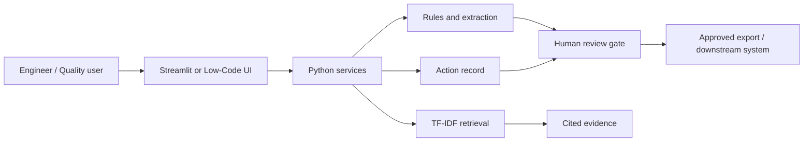
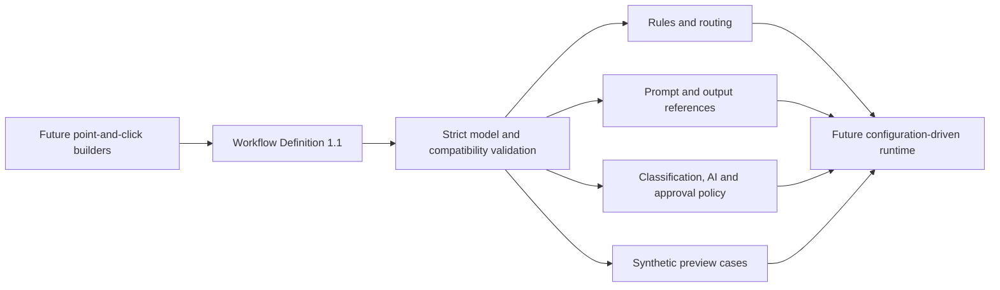

# Architecture

## Production evolution
Place APIs behind authentication, store approved records in a governed database, ingest only released documents, add observability, version prompts/models/rules, and integrate with QMS/MES/CMMS through approved interfaces.

## Phase 2 configuration architecture - Contract 1.1

Increment 2.1 establishes the configuration contract and validation boundary. It does not yet replace the Phase 1 runtime or add the Workflow Studio user interface.
