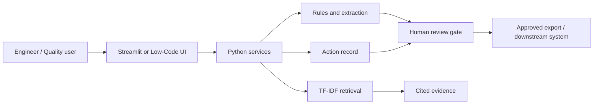

# Architecture

## Production evolution
Place APIs behind authentication, store approved records in a governed database, ingest only released documents, add observability, version prompts/models/rules, and integrate with QMS/MES/CMMS through approved interfaces.
