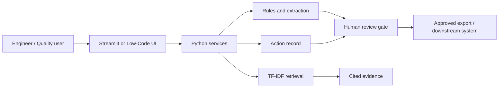

# Architecture

## Production evolution
Place APIs behind authentication, store approved records in a governed database, ingest only released documents, add observability, version prompts/models/rules, and integrate with QMS/MES/CMMS through approved interfaces.

## Phase 2.2 catalog architecture

Workflow Studio calls the template catalog registry, which discovers JSON definitions, validates each through Workflow Definition Contract 1.1, presents summaries, and creates deep-copy draft previews through controlled lifecycle services. The current catalog is read-only with respect to operational systems and repository storage.
