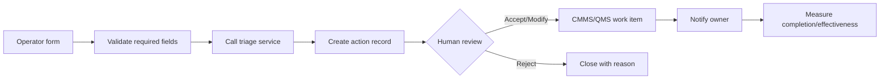

# Low-Code Workflow

```mermaid
flowchart LR
  F[Operator form] --> V[Validate required fields]
  V --> T[Call triage service]
  T --> R[Create action record]
  R --> H{Human review}
  H -->|Accept/Modify| W[CMMS/QMS work item]
  H -->|Reject| C[Close with reason]
  W --> N[Notify owner]
  N --> M[Measure completion/effectiveness]
```

Power Apps/AppSheet fields map directly to the input and output schemas. Production integration should use a secured API, managed connector and role-based authorization.
